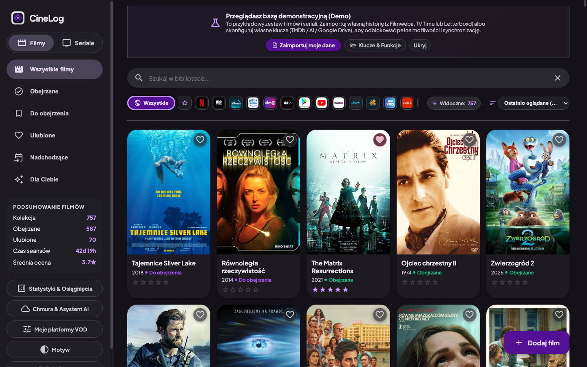

<p align="center">
  
</p>

# 🎬 CineLog

<p align="center">
  <strong>Lekki, nowoczesny i w 100% prywatny menedżer biblioteki filmów i seriali (PWA) z asystentem AI, synchronizacją Google Drive i interfejsem Material 3 Expressive.</strong>
</p>

<p align="center">
  <a href="https://pavvel42.github.io/CineLog/"></a>
  <a href="https://github.com/pavvel42/CineLog/actions/workflows/ci.yml"></a>
  
  
  
</p>

---

## 📸 Zrzut ekranu

<p align="center">
  
</p>

---

## ✨ Główne możliwości

- 🎞️ **Biblioteka Filmów i Seriali**: Wygodne zarządzanie seansami (*Obejrzane*, *Do obejrzenia*), ocenianie w skali gwiazdkowej, ulubione oraz licznik ponownych seansów (*rewatch*).
- 📺 **Śledzenie Odcinków (Episode Tracker)**: Intuicyjne oznaczanie obejrzanych sezonów i odcinków, statusy premier (*w produkcji*, *zakończony*) oraz powiadomienia o nadchodzących epizodach.
- 📥 **Uniwersalny Importer**: 
  - 🎬 **Filmweb** (eksport CSV)
  - 💚 **Letterboxd** (eksport CSV)
  - ⭐ **IMDb** (eksport CSV)
  - ⏱️ **TV Time** (pliki JSON / eksport GDPR)
  - 📦 **CineLog JSON** (pełna kopia zapasowa)
- 🤖 **Filmowy Asystent AI (BYOK – Bring Your Own Key)**:
  - Bezpieczny czat strumieniowy z modelem AI analizującym Twój gust filmowy i historię ocen.
  - Obsługa wiodących dostawców: **OpenAI**, **DeepSeek**, **Groq** (darmowy i błyskawiczny), **OpenRouter** oraz lokalnego **Ollama** (100% offline).
  - Interaktywne karty filmów, inteligentne wzmianki `@tytuł` i dodawanie polecanych pozycji 1 kliknięciem.
- ☁️ **Kopia i synchronizacja Google Drive**: Pełna, automatyczna synchronizacja biblioteki z Twoim prywatnym Dyskiem Google (bez zewnętrznych serwerów bazodanowych).
- 📊 **Statystyki & Osiągnięcia**: Wykresy czasu spędzonego przed ekranem, ulubione dekady i gatunki, katalog reżyserów oraz odznaki kinomana.
- 📺 **Filtry Platform VOD**: Błyskawiczne filtrowanie filmów pod kątem dostępności na platformach streamingowych (Netflix, HBO Max, Disney+, Prime Video, SkyShowtime, Apple TV, CANAL+ i inne).
- 📅 **Eksport Kalendarza & Danych**: Pobieranie kopii JSON/CSV oraz eksport premier do kalendarza `.ics` (Google Calendar, Apple Calendar, Outlook).
- 📱 **Progresywna Aplikacja Webowa (PWA)**: Możliwość instalacji na telefonie (iOS / Android) lub pulpicie z pełnym dostępem offline.

---

## 🚀 Szybki start

### Opcja A: Wersja Statyczna (np. GitHub Pages / Zero konfiguracji)

CineLog działa od razu w przeglądarce bez konieczności uruchamiania serwera!
1. Otwórz stronę projektu na **GitHub Pages** (lub uruchom lokalny plik `index.html`).
2. Zaimportuj swoją historię filmową z Filmweba, TV Time lub Letterboxd za pomocą *Uniwersalnego Importera*.
3. Wszystkie Twoje dane będą bezpiecznie przechowywane lokalnie w pamięci Twojej przeglądarki (`localStorage`).

---

### Opcja B: Wersja Pełna (Lokalny serwer Flask + Wyszukiwarka TMDb)

Uruchomienie lokalnego serwera Flask odblokowuje wyszukiwarkę online nowych filmów i seriali na żywo z bazy TMDb oraz automatyczne pobieranie metadanych.

#### 1. Klonowanie repozytorium
```bash
git clone https://github.com/pavvel42/CineLog.git
cd CineLog
```

#### 2. Konfiguracja kluczy API (.env)
Klucze są opcjonalne — aplikacja działa też bez nich, a każdy użytkownik może wpisać własny w interfejsie (*Chmura & Asystent AI* -> *Klucze API*). **Klucz podany w przeglądarce ma pierwszeństwo** nad tym z `.env`.
1. Zarejestruj darmowe konto na [The Movie Database (TMDb)](https://www.themoviedb.org/).
2. W [Ustawienia -> API](https://www.themoviedb.org/settings/api) wygeneruj darmowy klucz API (v3 auth) — odblokowuje wyszukiwarkę i metadane na żywo.
3. Opcjonalnie wygeneruj darmowy 8-znakowy klucz [OMDb](https://www.omdbapi.com/apikey.aspx) — dociąga oceny IMDb i plakaty jako fallback.
4. Skopiuj szablon konfiguracji i wpisz klucze:
   ```bash
   cp .env.example .env
   chmod 600 .env   # plik z kluczami tylko dla Ciebie (.env jest ignorowany przez git)
   ```
   ```env
   TMDB_API_KEY=twoj_klucz_tmdb_tutaj
   OMDB_API_KEY=twoj_klucz_omdb_tutaj   # opcjonalny
   ```
   > Nazwy `IMDB_API_KEY` lepiej nie używać: to historyczny alias OMDb, honorowany tylko dla wartości 8-znakowej. Klucz TMDb wpisany w tym miejscu jest ignorowany z ostrzeżeniem w logu.
5. **Google Drive (opcjonalnie):** identyfikator klienta OAuth to wartość publiczna (podróżuje w adresie przeglądarki), więc trzymamy go osobno od kluczy — ale tak samo w `.env`:

   ```bash
   GOOGLE_CLIENT_ID=1234567890-xxxxxxxx.apps.googleusercontent.com   # typ klienta: "Web application"
   ```

   Przy starcie `run.py` wpisuje tę wartość do `static/js/config.js`, więc nie musisz jej wklejać na każdym urządzeniu. Zaakceptowana jest też nazwa `ID_Project_Google_Cloud`. Wartość, która nie jest identyfikatorem klienta (np. numer projektu albo klucz API), jest odrzucana z ostrzeżeniem w logu — Google odpowiadał na nią mylącym błędem `401 invalid_client` („The OAuth client was not found"), który wygląda jak problem z uprawnieniami konta, a oznacza tylko nieznany identyfikator klienta.

Pozostałe zmienne (wszystkie opcjonalne): `HOST` (domyślnie `127.0.0.1`), `PORT` (domyślnie `5001`), `FLASK_DEBUG=1` oraz `DATA_DIR` (katalog plików JSON, przydatny do izolowanych testów).

#### 3. Uruchomienie aplikacji
Wymagany Python 3.9+ (CI testuje na 3.12; lokalnie działa też 3.14):
```bash
pip install -r requirements.txt
python3 run.py
```
Aplikacja uruchomi się pod adresem: **`http://localhost:5001`**.

#### 4. Build frontendu (przy zmianach w JS)
Frontend jest serwowany ze zminifikowanego bundla (`static/dist/app.min.js`, budowany esbuildem). Po modyfikacji plików w `static/js/` przebuduj:
```bash
npm ci
npm run build   # lub: npm run watch (przebudowa przy zapisie)
```
CI weryfikuje, że zacommitowany bundle jest aktualny względem źródeł.

#### 5. Pełna weryfikacja (testy i kontrole jakości)
```bash
pip install pytest mypy pyflakes
npx playwright install chromium
npm run verify   # pytest -> mypy -> pyflakes -> zgodność data/ -> kontrola frontendu -> e2e
```
Bramkę warto przepuścić także bez kluczy w środowisku (`TMDB_API_KEY= OMDB_API_KEY= npm run verify`) — testy nie mogą zależeć od Twojego `.env`.

---

## 🛡️ Dwa elastyczne tryby pracy: Pełna Prywatność vs Wygodna Chmura

CineLog został zaprojektowany w architekturze *Privacy-First* – to Ty decydujesz, jak chcesz zarządzać swoją bazą:

| Funkcjonalność | 🔒 Opcja 1: Pełna Prywatność (100% Offline) | ☁️ Opcja 2: Wygodna Synchronizacja (Google Drive) |
| :--- | :--- | :--- |
| **Gdzie przechowywana jest baza?** | Wyłącznie lokalnie w pamięci Twojej przeglądarki (`LocalStorage`). | Bezpośrednio w prywatnym pliku `cinelog_database.json` na Twoim Dysku Google. |
| **Wymagane logowanie / konta?** | **Brak.** Zero rejestracji, brak logowania, brak zewnętrznych serwerów. | Jednorazowe logowanie przez oficjalne Google OAuth (bez pośredników). |
| **Zarządzanie kopią zapasową** | Ręczny import (Filmweb, Letterboxd, IMDb, TV Time) oraz eksport JSON/CSV w dowolnym momencie. | Pełna, automatyczna synchronizacja w tle przy każdej zmianie na każdym urządzeniu. |
| **Asystent AI & Oceny** | Własne klucze API (OpenAI, DeepSeek, darmowy Groq lub lokalny Ollama) zapisane w przeglądarce. | Te same klucze API bezpiecznie przechowywane na Twoim urządzeniu. |
| **Migracja między trybami** | Możesz zacząć w 100% prywatnym trybie offline i w dowolnej chwili pobrać plik kopii zapasowej JSON. | **Bezproblemowa migracja:** Gdy zechcesz przejść z trybu prywatnego na wygodny – jedno kliknięcie *Zaloguj przez Google* w oknie *Chmura & Asystent AI* automatycznie wyeksportuje i zsynchronizuje całą Twoją dotychczasową lokalną bazę na Dysk Google bez utraty danych! |

---

## 🧭 Tryby biblioteki (klient / serwer Flask / demo)

Okno **Tryb i Środowisko** pozwala wybrać, na jakiej bazie pracuje aplikacja — i żaden z tych trybów nie nadpisuje Twojej biblioteki po cichu:

| Tryb | Na czym pracuje | Co to znaczy w praktyce |
| :--- | :--- | :--- |
| **Tryb klienta** | Biblioteka w przeglądarce (`LocalStorage`), opcjonalnie zsynchronizowana z Twoim Dyskiem Google. | Twoje dane są w 100% Twoje; działa też bez żadnego serwera (GitHub Pages). |
| **Lokalny serwer Flask** | Pliki JSON na Twoim dysku (`data/`), czyli baza serwera. | Wyszukiwarka i metadane online. Serwer trzyma **osobną** bazę (`cinelog_database_server`), więc biblioteka z przeglądarki zostaje nietknięta. |
| **Baza demonstracyjna (Demo)** | Wzorcowa kolekcja 50 filmów i 25 seriali. | Do bezpiecznego testowania funkcji bez ryzyka dla własnych danych. |

Przy pierwszym uruchomieniu tryb wybiera się sam: działający backend -> serwer Flask, wcześniej zaimportowana biblioteka -> tryb klienta, nowy użytkownik bez importu -> demo. Wybór przypinasz w oknie **Tryb i Środowisko** i jest pamiętany w przeglądarce.

Zasady, które temu pilnują:
- **Przełączenie na tryb serwera pyta o zgodę** i nigdy nie kasuje biblioteki użytkownika — to dwie różne bazy.
- **Każde nadpisanie bazy** (Pull z Dysku, scalanie, import, przełączenie trybu, reset demo) najpierw zapisuje kopię. Cofniesz to przyciskiem **Przywróć poprzednią bazę** w oknie *Tryb i Środowisko*.
- **Autozapis na Google Drive działa tylko w trybie klienta** — sesja na serwerowym ziarnie danych nie wypchnie go do Twojej chmury.

---

## 🔑 Konfiguracja opcjonalnych integracji

### 1. Asystent AI (BYOK – Bring Your Own Key)
CineLog nie wymaga konfiguracji AI na serwerze – każdy użytkownik może podać swój własny klucz bezpośrednio w aplikacji:
1. W menu bocznym wybierz **Chmura & Asystent AI** -> zakładka **Asystent AI**.
2. Wybierz preferowanego dostawcę (np. darmowy i ultraszybki *Groq*, *OpenAI*, *DeepSeek*, *OpenRouter* lub lokalny *Ollama* działający 100% na Twoim komputerze).
3. Wpisz swój klucz API i kliknij *Zapisz*. Klucz jest weryfikowany na żywo i przechowywany wyłącznie lokalnie.

### 2. Klucze TMDb i OMDb / IMDb
W zakładce **Chmura & Asystent AI** -> **Klucze API** możesz skonfigurować:
- **TMDb API (The Movie Database):** Darmowy klucz odblokowujący rekomendacje na żywo, odkrywanie nowości i nadchodzące odcinki.
- **OMDb / IMDb API:** Opcjonalny darmowy klucz do pobierania punktowych ocen i danych IMDb.

### 3. Wygodna synchronizacja z Google Drive

CineLog oferuje dwa proste sposoby konfiguracji Google Drive:
- **Sposób A (Wprost w interfejsie aplikacji – bez dotykania kodu):**
  1. W menu bocznym otwórz **Chmura & Asystent AI** -> zakładka **Dysk Google**.
  2. Kliknij **Opcje zaawansowane (Własny Google Client ID)** i wklej swój identyfikator.
  3. Zostanie on zapamiętany w Twojej przeglądarce i od razu umożliwi logowanie.
- **Sposób B (Dla twórcy / domyślna konfiguracja projektu):**
  1. Skopiuj szablon konfiguracji:
     ```bash
     cp static/js/config.example.js static/js/config.js
     ```
  2. W [Google Cloud Console](https://console.cloud.google.com/) utwórz projekt, włącz Google Drive API i utwórz identyfikator *OAuth 2.0 Client ID* dodając autoryzowane domeny (`https://twoj-login.github.io` oraz `http://localhost:5001`).
  3. Wklej Client ID w pliku `static/js/config.js`:
     ```javascript
     window.CINELOG_CONFIG = {
       GOOGLE_CLIENT_ID: "twoj-id-klienta.apps.googleusercontent.com"
     };
     ```

---

## 🔒 Prywatność i Bezpieczeństwo

- **100% Prywatności:** Twoja biblioteka, oceny i historia oglądania nie trafiają na żaden zewnętrzny serwer śledzący.
- **Brak trackerów i telemetrii:** Zero zewnętrznych skryptów analitycznych i reklamowych.
- **Bezpieczeństwo kluczy:** Wszelkie klucze API (AI, TMDb, OMDb, Google OAuth) należą wyłącznie do Ciebie i nie opuszczają Twojego urządzenia.
- **Klucze nie trafiają do adresów URL ani logów:** do własnego backendu wędrują wyłącznie w nagłówkach (`X-TMDB-Key`, `X-OMDb-Key`), a serwer maskuje ich wartości w logu dostępu. Pliki `.env` oraz `static/js/config.js` są ignorowane przez git — w repozytorium i w historii commitów nie ma żadnych kluczy.

> [!NOTE]
> **Baza demo:** katalogi `data/` oraz `static/data/` zawierają **próbkę 50 filmów i 25 seriali** utworzoną skryptem `scripts/make_demo_sample.py`: metadane tytułów (plakaty, sezony, identyfikatory TMDb) pochodzą z wcześniejszej bazy demonstracyjnej, natomiast cały behawior — oceny, statusy, daty i obejrzane odcinki — jest wygenerowany syntetycznie (deterministyczny seed). Wpisy mają nowe identyfikatory UUID i nie da się ich powiązać z żadnym rzeczywistym użytkownikiem. Twoja własna biblioteka tworzona w aplikacji pozostaje wyłącznie lokalnie na Twoim urządzeniu (lub w Twoim prywatnym Dysku Google) i nigdy nie jest nigdzie wysyłana.

---

## 📄 Licencja

Projekt udostępniony na licencji [MIT](LICENSE).
